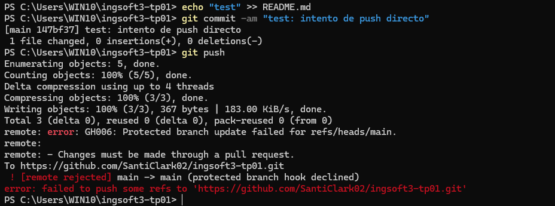
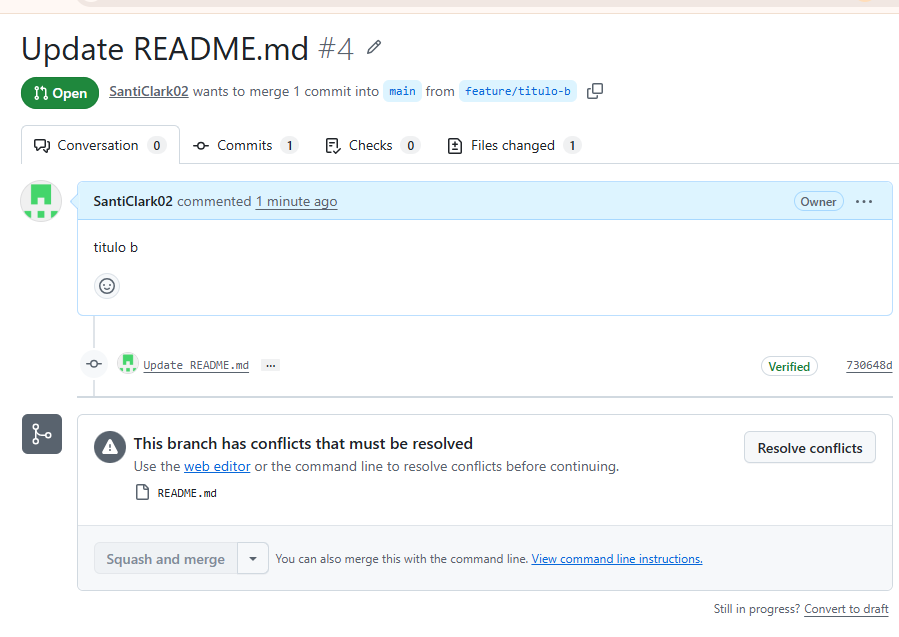
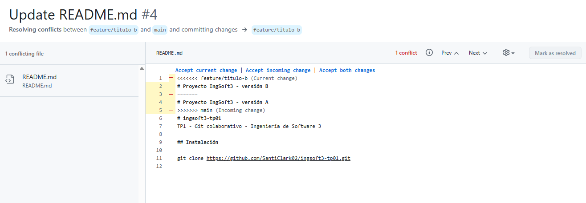
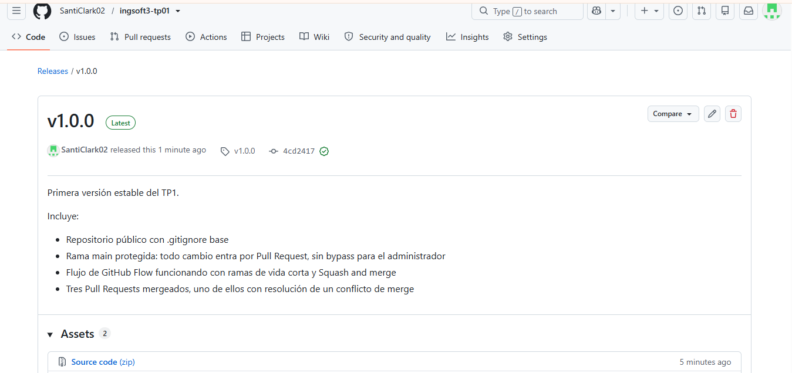

# Evidencias — TP1

Repositorio: https://github.com/SantiClark02/ingsoft3-tp01

Las cuatro capturas corresponden a momentos irrepetibles del trabajo práctico: una vez
que ocurrieron, el estado que muestran no se puede volver a reproducir.

---

## 1. Push directo a main rechazado

Intento de `git push` directo sobre `main` después de haber configurado la protección
de rama. GitHub recibe los objetos (`Writing objects: 100%`) pero rechaza la
actualización con `GH006: Protected branch update failed` y el mensaje
`Changes must be made through a pull request`.

El rechazo se produjo siendo yo el dueño y administrador del repositorio: eso es la
opción **Do not allow bypassing the above settings** funcionando. Sin ella, GitHub me
habría dejado saltear la regla.

El commit local usado para la prueba se deshizo después con `git reset --hard HEAD~1`.

---

## 2. El PR de la rama B no se puede mergear: conflicto

Pull Request #4, de `feature/titulo-b` hacia `main`. GitHub avisa
**"This branch has conflicts that must be resolved"** e indica el archivo afectado
(`README.md`). El botón *Squash and merge* aparece deshabilitado.

Las ramas `feature/titulo-a` y `feature/titulo-b` nacieron del mismo commit de `main`
y modificaron la misma línea del README con contenido distinto. Al mergear primero la A,
la B quedó en conflicto: la plataforma no puede integrarla automáticamente porque hay
dos versiones incompatibles de la misma línea.

---

## 3. Los marcadores del conflicto, antes de resolverlo

Editor de resolución de conflictos de GitHub, mostrando cómo Git delega la decisión
marcando el archivo:

- `<<<<<<<` abre el bloque en conflicto, con el contenido de la rama que se está integrando.
- `=======` separa las dos versiones.
- `>>>>>>>` cierra el bloque, con el contenido que ya está en `main`.

Los tres símbolos son fronteras, no contenido: hay que borrarlos al resolver. El botón
*Resolve* permanece deshabilitado mientras quede alguno en el archivo.

Esta captura se tomó antes de editar el archivo, porque los marcadores desaparecen al
resolver y no vuelven a estar disponibles.

---

## 4. Release v1.0.0 publicada

Release `v1.0.0` publicada en GitHub, asociada al tag del mismo nombre y al commit
`4cd2417`, que es el estado final de `main` al cerrar el práctico.

El tag se creó localmente con `git tag -a v1.0.0` y se publicó con
`git push origin v1.0.0`: los tags no viajan con un `git push` normal, hay que
empujarlos explícitamente.
