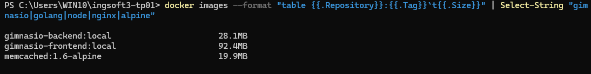
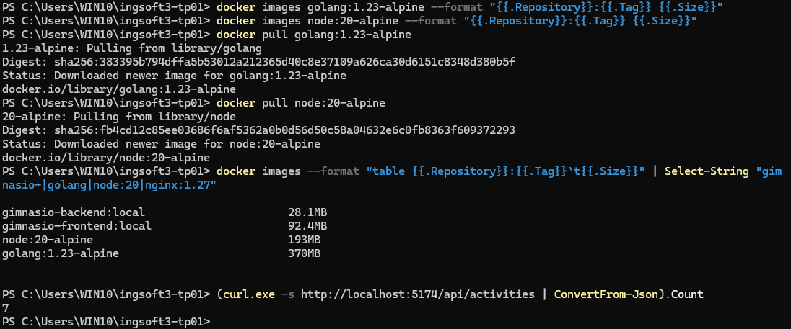
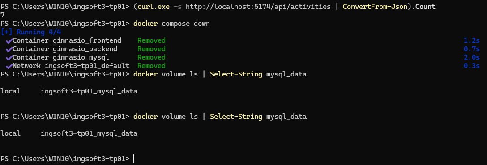
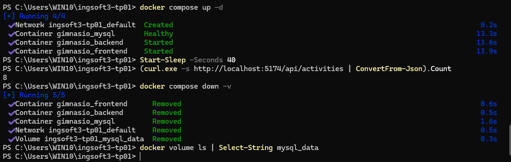
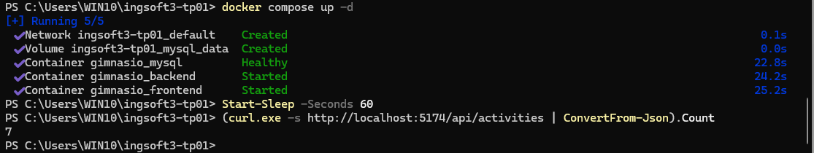
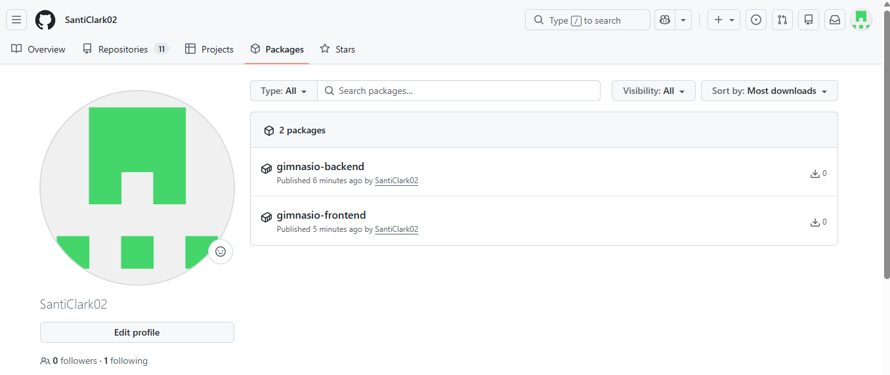
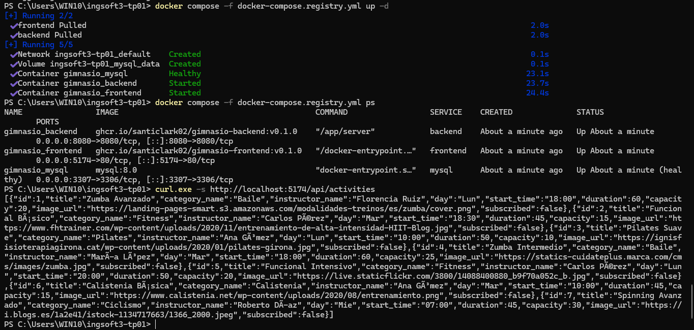

---

# Evidencias — TP2

Repositorio: https://github.com/SantiClark02/ingsoft3-tp01

Aplicación: sistema de gestión de gimnasio. Backend en Go (Gin + GORM), frontend en React +
Vite servido por nginx, base de datos MySQL 8. Todo orquestado con Docker Compose.

---

## 1. Primera medición de tamaños: faltaban las imágenes de build

Salida de `docker images` filtrada, mostrando las dos imágenes finales del proyecto:
`gimnasio-backend:local` en **28.1 MB** y `gimnasio-frontend:local` en **92.4 MB**.

Esta primera medición estaba incompleta: no aparecen las imágenes de build
(`golang:1.23-alpine` y `node:20-alpine`) porque BuildKit no las deja registradas en
`docker images` — quedan en la caché interna de build. Sin esos dos números, la comparación que
pide la consigna no se puede hacer.

Se corrige en la evidencia siguiente.

---

## 2. Comparación de tamaños: imagen de build vs imagen final

Tras traer explícitamente las imágenes base con `docker pull`, la tabla muestra los cuatro
valores necesarios para la comparación:

| Imagen | Rol | Tamaño |
|---|---|---|
| `golang:1.23-alpine` | build del backend | **370 MB** |
| `gimnasio-backend:local` | runtime del backend | **28.1 MB** |
| `node:20-alpine` | build del frontend | **193 MB** |
| `gimnasio-frontend:local` | runtime del frontend | **92.4 MB** |

**Esto es lo que demuestra el multi-stage.** La imagen final del backend pesa un **92% menos**
que la que se usó para compilarlo: el compilador de Go, el módulo cache y el código fuente
quedan en la etapa de build y no se copian a la imagen de producción. Solo viaja el binario.

El frontend baja un 52%, una reducción menor porque las imágenes de fondo de la aplicación
pesan unos 8 MB y sí forman parte del contenido servido por nginx.

Más allá del tamaño, la ventaja es de seguridad: una imagen de producción sin compiladores ni
gestores de paquetes ofrece muchas menos herramientas a quien logre entrar en ella.

Al pie se ve el conteo inicial de actividades vía API: **7 registros**, los que siembra
`db.sql`.

---

## 3. `docker compose down`: los contenedores se eliminan, el volumen sobrevive

Punto de partida del ensayo de persistencia. La API devuelve **7 actividades**.

Al ejecutar `docker compose down` se eliminan los tres contenedores y la red creada por
Compose. Inmediatamente después, `docker volume ls` muestra que
**`ingsoft3-tp01_mysql_data` sigue existiendo**.

Esa es la diferencia clave: los contenedores son efímeros y se reconstruyen desde la imagen,
pero el volumen es un artefacto independiente de su ciclo de vida. Los datos de la base viven
ahí, no dentro del contenedor.

---

## 4. Los datos creados sobreviven al `down` y desaparecen con `down -v`

Al levantar de nuevo con `docker compose up -d`, la API devuelve **8 actividades**: las 7
sembradas más un registro de prueba creado desde el frontend, que sobrevivió al ciclo de
apagado y encendido. *(La creación de ese registro se hizo a través de la interfaz web y por
eso no aparece en la terminal.)*

En la misma captura se ejecuta `docker compose down -v`. La diferencia con el `down` anterior
está en la última línea de la salida: además de los contenedores y la red, se elimina
**`Volume ingsoft3-tp01_mysql_data  Removed`**. El `docker volume ls` posterior no devuelve
nada.

También se observa el healthcheck en funcionamiento: MySQL tarda **13.3 segundos** en
reportarse `Healthy` y el backend arranca recién a los 13.6. Sin `depends_on: service_healthy`,
el backend habría arrancado de inmediato contra una base que todavía no aceptaba conexiones.

---

## 5. Tras `down -v`, los datos creados se perdieron

Al levantar el sistema con el volumen eliminado, la API devuelve nuevamente **7 actividades**.
El registro de prueba ya no está.

**Por qué vuelven 7 y no 0:** al no existir el volumen, MySQL se inicializa desde cero y vuelve
a ejecutar los scripts de `/docker-entrypoint-initdb.d/`, entre ellos `db.sql`. Los datos
*sembrados* reaparecen; los *creados durante el uso* se perdieron para siempre.

Esa distinción es el punto del ensayo: `down` es una operación de rutina, `down -v` destruye
datos y no tiene vuelta atrás.

Nótese además que en este arranque MySQL tardó **22.8 segundos** en estar sano, contra los
13.3 del arranque anterior. La diferencia es que con el volumen recién creado tiene que
ejecutar el script de inicialización antes de aceptar conexiones — otro argumento a favor de
usar healthcheck y no una espera fija.

---

## 6. Imágenes publicadas en GitHub Container Registry

Las dos imágenes del proyecto publicadas en ghcr.io bajo la cuenta `SantiClark02`:
`gimnasio-backend` y `gimnasio-frontend`, ambas con tag semántico `v0.1.0`.

Los packages de GitHub se crean privados por defecto; la visibilidad de ambos se cambió
manualmente a **pública** desde *Package settings → Change visibility*.

La página confirma que las imágenes existen en el registry, pero **no alcanza como prueba de
que sean descargables**: eso se demuestra en la evidencia siguiente.

---

## 7. El sistema completo levantado desde el registry, sin credenciales y sin construir nada

Es la evidencia más completa del trabajo práctico. La secuencia previa al comando fue
deliberada:

1. `docker compose down -v` — se destruyó el entorno anterior.
2. `docker logout ghcr.io` — **se cerró la sesión contra el registry**.
3. `docker rmi ghcr.io/santiclark02/gimnasio-backend:v0.1.0` y la del frontend — **se borraron
   las imágenes locales**.

Recién entonces se ejecutó `docker compose -f docker-compose.registry.yml up -d`, y la salida
muestra `frontend Pulled` y `backend Pulled`: **las imágenes se descargaron de internet**.

`docker compose ps` confirma que los contenedores corren a partir de
`ghcr.io/santiclark02/gimnasio-backend:v0.1.0` y `ghcr.io/santiclark02/gimnasio-frontend:v0.1.0`,
no de imágenes construidas localmente. MySQL aparece como `healthy`.

La petición final a `http://localhost:5174/api/activities` devuelve el catálogo completo en
JSON.

**Qué demuestra técnicamente, en un solo comando:**

- Las imágenes son **realmente públicas**: se descargaron sin ninguna credencial.
- El sistema se puede levantar **sin el código fuente**, solo con las imágenes publicadas.
- La cadena completa funciona: el navegador o cliente pega en el **frontend** (puerto 5174),
  **nginx** enruta `/api` hacia el **backend** por la red interna de Compose, y el backend
  consulta **MySQL** por el nombre de servicio `mysql`.

Esta prueba es más exigente que ver la imagen listada en una página web: reproduce las
condiciones de una máquina que nunca vio el proyecto.
