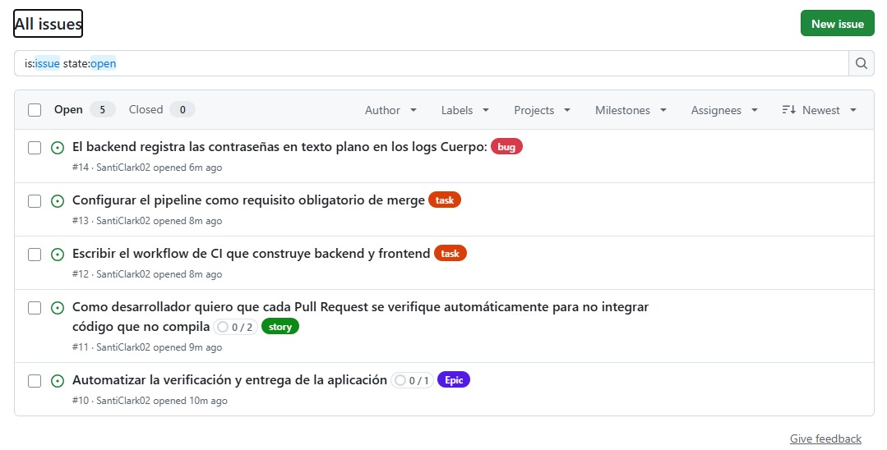
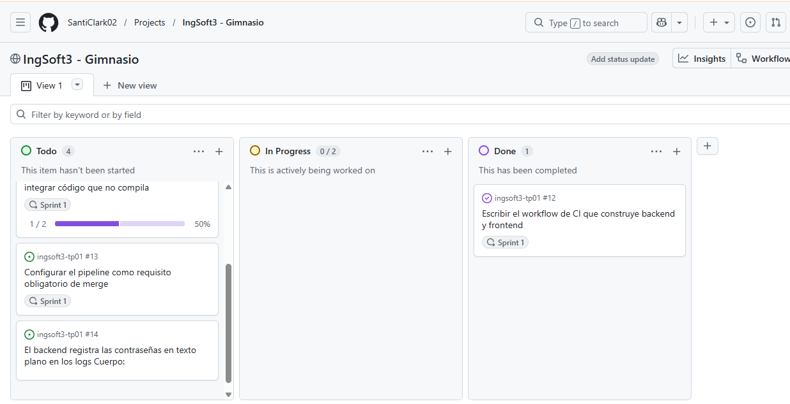
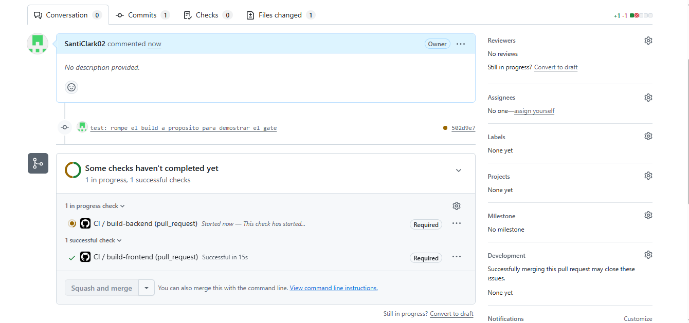

---

# Evidencias — TP3

Proyecto público: https://github.com/users/SantiClark02/projects/1

> Nota: las consignas del TP3 y el TP4 no exigen `evidencias.md`, porque el repositorio y el
> Project son públicos y quien corrige los abre y ve el estado en vivo. Estas capturas se
> incluyen igualmente para dejar registrados algunos momentos puntuales del proceso, que en el
> estado final ya no son visibles.

---

## 1. Los cinco work items con su jerarquía y sus etiquetas

Listado completo de issues del repositorio, tomado antes de implementar la primera tarea. Se
ven los cinco elementos del práctico con sus etiquetas:

| # | Item | Etiqueta |
|---|---|---|
| #10 | Automatizar la verificación y entrega de la aplicación | `Epic` |
| #11 | Como desarrollador quiero que cada Pull Request se verifique automáticamente… | `story` |
| #12 | Escribir el workflow de CI que construye backend y frontend | `task` |
| #13 | Configurar el pipeline como requisito obligatorio de merge | `task` |
| #14 | El backend registra las contraseñas en texto plano en los logs | `bug` |

Los contadores confirman la jerarquía: la épica muestra **0/1** (un sub-issue: la historia) y la
historia **0/2** (sus dos tareas). En este momento nada estaba cerrado todavía.

El **bug no aparece con contador** porque no tiene sub-issues ni cuelga de ningún otro item:
está al costado de la jerarquía. Es un defecto de algo que ya existe —detectado durante el TP2
al leer los logs del backend—, no trabajo planificado dentro de la historia. Colgarlo de ella
distorsionaría el pronóstico del sprint.

En cuentas personales de GitHub los tipos nativos de issue (Epic, Story, Task) no están
disponibles, por lo que la clasificación se hace con etiquetas.

---

## 2. El tablero: sprint, límite de trabajo en progreso y automatización

Vista de tablero del Project `IngSoft3 - Gimnasio`. El ícono de globo junto al título indica que
**el proyecto es público**, requisito explícito de la consigna.

Tres cosas visibles en esta captura:

**El límite de trabajo en progreso.** La columna *In Progress* muestra **`0 / 2`**. El número
lo elegí siguiendo la regla de arranque —cantidad de personas más uno; trabajando solo, dos—.
El "+1" es la válvula para cuando algo queda esperando y hace falta avanzar en otra cosa.
GitHub pone el contador en rojo al superarlo, pero **no lo impide**: es un acuerdo hecho
visible, no un candado de la herramienta.

**El sprint.** La historia y sus dos tareas llevan la etiqueta `Sprint 1`, la iteración de dos
semanas configurada como campo del proyecto. La épica y el bug quedan sin sprint: la épica
abarca varios, y el bug todavía no fue priorizado.

**La automatización funcionando.** El item **#12** está en *Done*: llegó ahí solo, sin
arrastrarlo, porque al cerrarse el issue el workflow del tablero lo movió.

También se ve la barra de progreso de la historia en **1/2 (50%)**: una de sus dos tareas está
completa. Un detalle importante: la historia **sigue abierta** pese a ese avance. Los workflows
del tablero actúan sobre el estado propio de cada item; cerrar las tareas no cierra la historia,
que se cierra explícitamente cuando corresponde.

---

# Evidencias — TP4

---

## 3. El gate bloqueando un merge

Pull Request de la demostración del gate. El commit es
`test: rompe el build a proposito para demostrar el gate`: se eliminó deliberadamente una llave
de cierre en `backend/main.go` para que el backend no compile.

Lo que demuestra la captura:

**Los dos checks figuran como `Required`.** `CI / build-backend` y `CI / build-frontend`
aparecen etiquetados así porque están configurados como *required status checks* sobre `main`.

**El botón `Squash and merge` está deshabilitado** (en gris). GitHub no permite integrar hasta
que los checks obligatorios terminen en verde. En este instante `build-backend` todavía estaba
corriendo —y terminó en rojo, por la llave faltante—, con lo que el merge quedó bloqueado.

**El frontend pasó en 15 segundos.** Es el cache de capas funcionando: como el `package.json`
no cambió, la capa de instalación de dependencias se reutilizó en vez de rehacerse. El backend
tarda más porque es el que se modificó.

Después de esta captura se completó la secuencia del práctico: se hizo el commit de corrección
sobre el mismo Pull Request, el pipeline volvió a correr solo, los dos checks pasaron a verde y
el botón de merge se habilitó. Esa secuencia **rojo → bloqueado → fix → verde → merge** queda
registrada en el historial del Pull Request.

**Qué exige hoy `main` para aceptar un merge**, y esta captura muestra las dos primeras:

1. Que el cambio venga por Pull Request (configurado en el TP1).
2. Que `build-backend` y `build-frontend` estén en verde.
3. Que la rama esté actualizada con `main` (`strict: true`).

Se rompió la compilación y no un test porque el testing es materia del TP5. El mecanismo del
gate es el mismo; desde entonces solo cambiará qué lo hace fallar.
